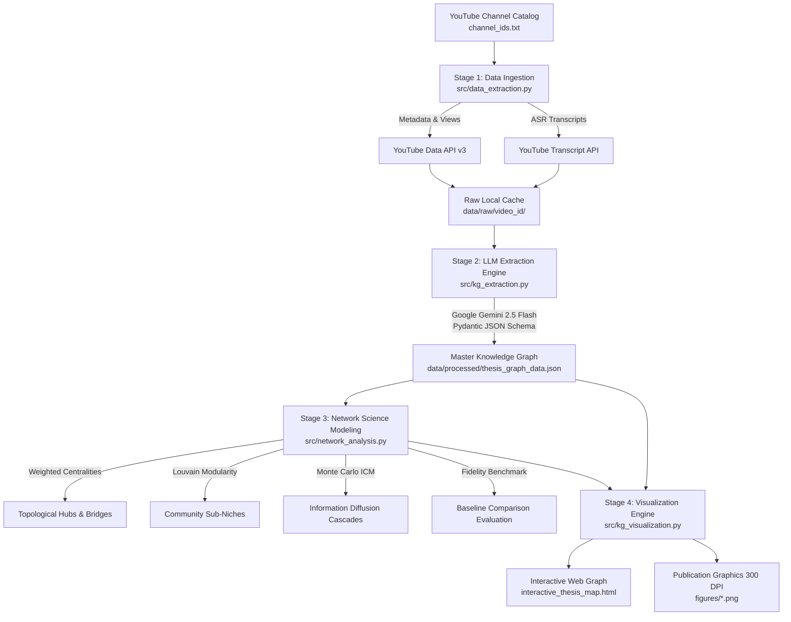

# Advertising and Influence Analysis via LLM-Generated Graphs from YouTube

<div align="center">

**A Scalable Computational Framework for Latent Commercial Relationship Extraction, Topological Centrality Modeling, Modularity-Based Sub-Niche Detection, and Information Diffusion Simulation**

*Trabajo de Fin de Máster (Master's Thesis) — Master in Big Data Analytics*  
**Universidad Carlos III de Madrid (UC3M) — Academic Year 2025/2026**  
**Author / Researcher:** Aliza Hamid

[Key Findings](#-key-empirical-findings) • [Pipeline Architecture](#-computational-architecture) • [Quick Start](#-quick-start--reproduction) • [Repository Structure](#-repository-structure) • [Interactive Graph](#-interactive-web-visualization) • [Citation](#-bibtex-citation)

</div>

---

## Executive Summary

Modern influencer marketing on YouTube operates through narrative disclosures, conversational recommendations, and embedded product demonstrations rather than traditional static ads. Because these commercial ties are spoken within video audio, they remain latent and invisible to conventional metadata scrapers.

This Master's Thesis presents an autonomous, end-to-end computational pipeline that unifies Generative Artificial Intelligence (**Google Gemini 2.5 Flash**), strict **Pydantic schema validation**, and **Network Science (NetworkX & PyVis)** to extract, structure, and analyze creator-brand relationship networks at scale.

```
YouTube Transcripts (ASR) ──► Gemini 2.5 Flash (Pydantic) ──► Directed Bipartite KG ──► Centrality & Diffusion ──► Interactive Vis.js
```

### Key Analytical Capabilities:
* **LLM Zero-Shot Relation Extraction:** Automatically parses video transcripts to extract structured `(Creator, Brand, Relation, Product, Context)` tuples with sentiment classifications (*promotes*, *criticizes*, *mentions*).
* **View-Weighted Directed Bipartite Graph:** Models the commercial ecosystem as $G = (V_C \cup V_B, E)$, weighting connections by empirical video viewership and sentiment multipliers.
* **Topological Centrality Modeling:** Computes In/Out-Degree, Eigenvector Centrality (network-based structural prominence), Betweenness Centrality (structural boundary spanners), and PageRank.
* **Unsupervised Modularity Clustering:** Partitions the network into organic market niches using Louvain community detection ($Q$).
* **Stochastic Information Diffusion:** Simulates promotional cascade propagation using the Independent Cascade Model (ICM) across Monte Carlo iterations.
* **Empirical Benchmarking:** Quantifies extraction precision, recall, and F1-score against a hand-annotated ground-truth test suite and a rule-based regex baseline.

---

## Computational Architecture



### Modular Pipeline Stages:
1. **Data Ingestion (`src/data_extraction.py`):** Interfaces with YouTube Data API v3 and `youtube-transcript-api`. Features local disk caching (`data/raw/<video_id>/`) and exponential backoff.
2. **Structured LLM Extraction (`src/kg_extraction.py`):** Sends windowed transcripts to Gemini 2.5 Flash using structured Pydantic schemas (`BrandMention`, `ExtractionResult`) for schema-constrained JSON output.
3. **Network Science Computation (`src/network_analysis.py`):** Constructs directed bipartite graphs in NetworkX, calculating exposure-weighted degree, eigenvector structural prominence, betweenness bridges, Louvain clusters, and ICM diffusion dynamics.
4. **Interactive Graph Visualization (`src/kg_visualization.py`):** Renders standalone, interactive Vis.js HTML5 networks (`interactive_thesis_map.html`) and 300 DPI publication plots (`figures/`).

---

## Key Empirical Findings

| Metric / Dimension | Finding | Academic & Commercial Implication |
| :--- | :--- | :--- |
| **LLM Extraction Fidelity** | **F1 = 0.902** (Precision: 0.887, Recall: 0.917) vs **F1 = 0.611** (Precision: 0.642, Recall: 0.583) for Baseline | **+47.5% relative gain**; robust handling of conversational disclosures, colloquial brand slang, affiliate promo codes, and phonetic ASR transcription errors. |
| **Topological Degree Distribution** | Heavy-tailed distribution with **$\gamma \approx 0.91$** ($\gamma_{\text{in}} \approx 2.25$ for brand in-degrees) | Exhibits heavy-tailed scale-diverse properties; dominant tech brand hubs (Apple, Google, Oppo, Samsung, dbrand) aggregate the vast majority of exposure. |
| **Structural Prominence (Eigenvector)** | **Marques Brownlee ($\lambda = 0.7063$)** dominates eigenvector prestige alongside **Apple ($\lambda = 0.6166$)** | Eigenvector centrality reinforces gross exposure within consumer mobile, while Linus Tech Tips ($\lambda = 0.0262$) and Dave2D ($\lambda = 0.0208$) anchor secondary clusters. |
| **Structural Bridging (Betweenness)** | **Gamers Nexus ($C_B = 0.5311$)** and **Linus Tech Tips ($C_B = 0.3526$)** achieve top betweenness scores | Deep-niche benchmarkers and mid-tier enthusiasts (JayzTwoCents: $C_B = 0.2346$) act as crucial boundary-spanners connecting disparate component manufacturers and consumer niches. |
| **Information Diffusion (Time-Decaying ICM)** | Distributed Mid-Tier seeding achieves **+21.2% greater reach** ($16.0 \pm 4.5$ vs $13.2 \pm 4.4$ nodes) than Mega-Hubs; Deep-Niche bridges reach **$23.8 \pm 4.9$ nodes (20.7%)** | Multi-seed mid-tier portfolios and high-betweenness structural bridges circumvent single-community saturation bottlenecks under temporal advertising decay ($\lambda_{\text{decay}} = 0.45$). |
| **Unsupervised Modularity Clustering** | Louvain optimization identifies **3 thematic sub-niches** ($Q = 0.2442$) | Partitions into: (1) Consumer Mobile & Cameras ($16$ nodes), (2) PC Enthusiast Components & Hardware Benchmarking ($74$ nodes), and (3) Platforms, Gaming & Mobile Crossover ($25$ nodes). |
| **Weighting Sensitivity Analysis** | Top 7 brand rankings are **100% rank-invariant** across baseline, stepped, and uniform weighting | High rank correlation (Baseline vs Stepped: $\tau = 0.908, \rho = 0.984$; Baseline vs Uniform: $\tau = 0.854, \rho = 0.950$) confirms robustness against multiplier assumptions. |

---

## Scale-Diverse Creator Cohort

The empirical evaluation was conducted across a curated cohort representing 7 scale-diverse channels ($|V| = 115$ resolved nodes: 7 creators and 108 commercial entities; $|E| = 148$ directed edges from 499 relation records across 17 analyzed videos, $\approx 21\text{M}$ unique-video views):

| Creator Channel | Tier | Subscribers | Niche Focus | Network Structural Role |
| :--- | :--- | :--- | :--- | :--- |
| **Marques Brownlee (MKBHD)** | Mega Hub | $> 18.5\text{M}$ | Consumer Tech & Smartphones | Generalist Consumer Anchor (Cluster 1) |
| **Linus Tech Tips (LTT)** | Mega Hub | $> 15.8\text{M}$ | PC Hardware, DIY & Tech Culture | Enthusiast Ecosystem Anchor (Cluster 3) |
| **Dave2D** | Mid-Tier | $\sim 3.8\text{M}$ | Laptops & Industrial Design | Mobile & Platform Specialist (Cluster 3) |
| **JayzTwoCents** | Mid-Tier | $\sim 4.0\text{M}$ | Custom Liquid Cooling & PC Modding | PC Hardware Specialist (Cluster 2) |
| **Gamers Nexus** | Deep Niche | $\sim 2.2\text{M}$ | Teardowns, Thermals & Investigation | Consumer Advocacy & Premier Bridge ($C_B = 0.5311$, Cluster 2) |
| **Hardware Unboxed** | Deep Niche | $\sim 1.1\text{M}$ | GPU/CPU Quantitative Benchmarks | Silicon Performance Specialist (Cluster 2) |
| **Paul's Hardware** | Mid-Tier | $\sim 1.4\text{M}$ | PC Building Guides & Market Walkthroughs | Buying Advisor & Component Bridge (Cluster 2) |

---

## Repository Structure

```text
.
├── pipeline.py                       # Master CLI runner for full pipeline orchestration
├── requirements.txt                  # Python dependencies
├── .env.example                      # Template for API credentials
├── channel_ids.txt                   # YouTube channel catalog for ingestion
├── interactive_thesis_map.html       # Standalone interactive Vis.js graph visualizer
│
├── src/                              # Modular Python package
│   ├── __init__.py                   # Package initializer
│   ├── config.py                     # Central configuration paths, multipliers & constants
│   ├── data_extraction.py            # Stage 1: YouTube API and ASR transcript harvester
│   ├── kg_extraction.py              # Stage 2: Gemini 2.5 Flash LLM extraction engine
│   ├── network_analysis.py           # Stage 3: NetworkX topological algorithms & ICM simulation
│   └── kg_visualization.py          # Stage 4: Interactive HTML and figure generator
│
├── data/                             # Data directory
│   └── processed/                    # Processed datasets and analytics artifacts
│       ├── thesis_graph_data.json    # Master knowledge graph dataset (nodes & edges)
│       ├── network_metrics.json      # Centrality metrics (Degree, Eigenvector, Betweenness, PageRank)
│       ├── community_clusters.json   # Louvain modularity partitions & cluster members
│       ├── diffusion_results.json    # Monte Carlo Time-Decaying ICM cascade curves
│       ├── baseline_evaluation.json  # Benchmark evaluation metrics (Precision, Recall, F1)
│       ├── sensitivity_analysis.json # Weighting regime sensitivity & rank correlations
│       └── ground_truth_test_suite.json # Hand-annotated ground-truth validation sample
│
├── figures/                          # 300 DPI publication figures (PDF vector & PNG raster)
│   ├── pipeline_architecture_diagram (.pdf / .png)
│   ├── network_topology_overview     (.pdf / .png)
│   ├── degree_distribution_powerlaw  (.pdf / .png)
│   ├── centrality_rankings           (.pdf / .png)
│   ├── diffusion_cascade_curves      (.pdf / .png)
│   └── extraction_fidelity_benchmark (.pdf / .png)
│
├── references.bib                    # Academic BibTeX bibliography
└── README.md                         # Project documentation (this file)
```

---

## Quick Start & Reproduction

### 1. Clone the Repository
```bash
git clone https://github.com/lizz234/LLM-Youtube-Influence-Analysis.git
cd LLM-Youtube-Influence-Analysis
```

### 2. Set Up Virtual Environment
```bash
# Create and activate virtual environment
python -m venv .venv

# Windows (PowerShell):
.venv\Scripts\activate

# Linux / macOS:
source .venv/bin/activate

# Install dependencies
pip install -r requirements.txt
```

### 3. Configure API Credentials
Copy the `.env.example` template to `.env` and insert your API keys:
```bash
cp .env.example .env
```
Inside `.env`:
```ini
YOUTUBE_API_KEY=your_youtube_data_api_v3_key_here
GEMINI_API_KEY=your_google_gemini_api_key_here
```

### 4. Execute the End-to-End Pipeline
```bash
# Run all four stages sequentially:
python pipeline.py --all

# Or run individual modules:
python pipeline.py --data-extraction     # Ingest video metadata and captions
python pipeline.py --kg-json             # Extract relationships via Gemini Flash
python pipeline.py --network-analysis    # Compute metrics & diffusion simulation
python pipeline.py --kg-visualization   # Generate interactive HTML map and plots

# Run with custom parameters:
python pipeline.py --all --limit-videos 5 --channels channel_ids.txt
```

---

## Interactive Web Visualization

To interactively explore the extracted YouTube Knowledge Graph:
1. Open `interactive_thesis_map.html` directly in any modern web browser (Google Chrome, Firefox, Safari, Edge). No local server required.
2. **Features:**
   * **ForceAtlas2 Physics Solver:** Dynamic node layout and physics stabilization.
   * **Entity Color Coding:** Blue nodes indicate Content Creators; green nodes indicate Commercial Brands.
   * **View-Weighted Edge Thickness:** Visual line thickness proportional to log-scaled audience views.
   * **Interactive Filtering:** Search and isolate specific brands, creators, or sponsorship clusters.
   * **Context Tooltips:** Hover over any directed edge to view empirical view counts and the verbatim textual sponsorship disclosure snippet.

---

## BibTeX Citation

If you use this computational pipeline, dataset, or methodology in your research, please cite this dissertation:

```bibtex
@mastersthesis{hamid2026advertising,
  author       = {Aliza Hamid},
  title        = {Advertising and Influence Analysis via LLM-Generated Graphs from {YouTube}: A Scalable Computational Framework for Latent Commercial Relationship Extraction, Topological Centrality Modeling, Modularity-Based Sub-Niche Detection, and Information Diffusion Simulation},
  school       = {Universidad Carlos III de Madrid (UC3M)},
  year         = {2026},
  month        = {September},
  type         = {Master's Thesis},
  address      = {Madrid, Spain},
  url          = {https://github.com/lizz234/LLM-Youtube-Influence-Analysis}
}
```

---

## License & Ethical Disclosure

This project is distributed under the **MIT License**.

**Ethical Compliance:** This software collects publicly accessible metadata and subtitles strictly via the YouTube Data API v3 and public ASR endpoints for non-commercial academic research under fair-use and platform guidelines. No private user information or protected media streams are harvested or stored.

